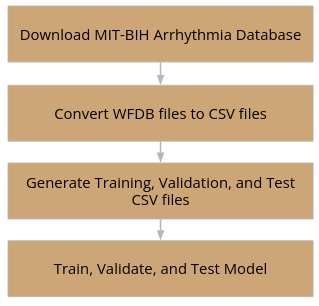

GitHub Link: [/ecg_classification](https://github.com/carrliitos/ecg_classification)

# Introduction

The exploration of classification algorithms on ECG data to detect heart disease lies in the ability of classification 
algorithms to analyze and interpret complex patterns within the ECG signals. Several compelling motivations drive this 
pursuit: firstly, classification algorithms enable the early identification of heart abnormalities and arrhythmias by 
discerning patterns indicative of various heart conditions. This capability is crucial for timely intervention and 
effective management of cardiovascular health. Additionally, the manual analysis of ECG signals is not only time-consuming 
but also demands specialized expertise, two important things I unfortunately do not have. Classification algorithms 
automate this process, providing an efficient and scalable approach to analyzing extensive volumes of ECG data, offering 
a practical solution for the challenges posed by manual ECG reading.

Furthermore, these algorithms offer an objective and consistent analysis of ECG data, mitigating the potential for human 
error or subjectivity in results interpretation. This consistency is vital for reliable and reproducible diagnostics. 
Lastly, different classification algorithms can be tailored to identify specific types of arrhythmias or abnormalities, 
enhancing the diagnostic capacity of the entire system and providing detailed insights into the nature of the heart 
condition.

# Prior Works

1. In 2022, Darmawahyuni et al. proposed a one-dimensional Convolutional Neural Network (1D-CNN) for ECG rhythm and beat 
classification. Notably, their approach simplified the classification process by employing a single deep learning 
architecture for both rhythm and beat features, achieving high accuracy across nine rhythm and fifteen beat classes. 
The low computational requirements of the 1D-CNN model enhance its suitability for real-time and cost-effective applications 
in ECG devices.
2. In 2023, Ramkumar et al. presented an ensemble classifier for arrhythmia detection, emphasizing the significance of 
their AD-Ensemble SVM-NB-RF method. The study aimed to create a universal model applicable to the general population, 
employing ensemble classifiers (SVMs, Naive Bayes, and random forest) for arrhythmia detection. The two-stage arrhythmia 
classification utilized Residual Exemplars of Local Binary Pattern (RELBP) for pre-processing ECG signals.
3. In 2019, Alfaras et al. introduced a fast machine learning model for ECG-based heartbeat classification and arrhythmia 
detection. Their proposed ensemble of Echo State Networks (ESNs) addressed the challenge of long computation times for 
classifiers, showcasing advantages in speed and memory over traditional methods. Recurrent connections and parallel 
computing architecture were key components of their methodology.

# Project Aims

# Conclusion

## Challenges Faced

The implementation of the ECG data classification project encountered several challenges throughout its development:

Firstly, the pre-processing phase posed a significant hurdle due to the unfamiliarity with processing waveform signals. 
While having extensive experience with unstructured text and tabular data, dealing with the intricacies of waveform 
signals proved time-consuming.

Secondly, the inherently noisy nature of ECG data complicated the accurate identification of each PQRST wave. To address 
this challenge, I had to make a strategic decision to switch to the MIT-BIH Arrhythmia dataset, renowned for its cleanliness 
and comprehensiveness. This change aimed to ensure the reliability and accuracy of the dataset, laying a robust foundation 
for subsequent analyses.

A hardware limitation further impacted the project. The initial intention was to implement TensorFlow’s DNNClassifier, a 
Deep Neural Network Classifier. However, due to the absence of the necessary hardware and GPUs for running the classifier 
on large amounts of data, an alternative solution was sought. Consequently, the Multilayer Perceptron (MLP) Classifier was 
adopted, ensuring computational feasibility within the existing hardware constraints.

## Overall Conclusion

The achieved exceptional metrics, including a remarkable accuracy of 98%, demonstrate the model's proficiency in accurately 
predicting arrhythmias from ECG data. With these metrics, there is a high level of confidence in the model's ability to 
precisely identify and classify arrhythmias. The success of the final model signifies the practical utility in providing 
reliable predictions, contributing to the field of ECG analysis, and facilitating early detection and intervention for 
cardiovascular health.
