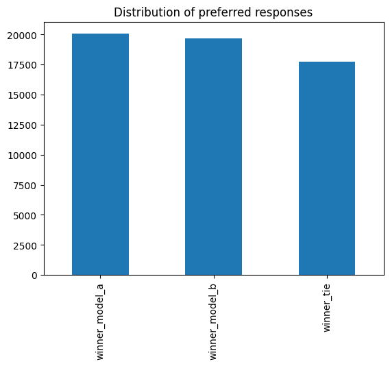

# From a while ago

```python
# This Python 3 environment comes with many helpful analytics libraries installed
# It is defined by the kaggle/python Docker image: https://github.com/kaggle/docker-python
# For example, here's several helpful packages to load

import numpy as np # linear algebra
import pandas as pd # data processing, CSV file I/O (e.g. pd.read_csv)

# Input data files are available in the read-only "../input/" directory
# For example, running this (by clicking run or pressing Shift+Enter) will list all files under the input directory

import os
for dirname, _, filenames in os.walk('/kaggle/input'):
    for filename in filenames:
        print(os.path.join(dirname, filename))

# You can write up to 20GB to the current directory (/kaggle/working/) that gets preserved as output when you create a version using "Save & Run All" 
# You can also write temporary files to /kaggle/temp/, but they won't be saved outside of the current session
```

    /kaggle/input/llm-classification-finetuning/sample_submission.csv
    /kaggle/input/llm-classification-finetuning/train.csv
    /kaggle/input/llm-classification-finetuning/test.csv


```python
train_df = pd.read_csv("/kaggle/input/llm-classification-finetuning/train.csv")
test_df = pd.read_csv("/kaggle/input/llm-classification-finetuning/test.csv")
```


```python
train_df.head()
```


<div>
<style scoped>
    .dataframe tbody tr th:only-of-type {
        vertical-align: middle;
    }

    .dataframe tbody tr th {
        vertical-align: top;
    }

    .dataframe thead th {
        text-align: right;
    }
</style>
<table border="1" class="dataframe">
  <thead>
    <tr style="text-align: right;">
      <th></th>
      <th>id</th>
      <th>model_a</th>
      <th>model_b</th>
      <th>prompt</th>
      <th>response_a</th>
      <th>response_b</th>
      <th>winner_model_a</th>
      <th>winner_model_b</th>
      <th>winner_tie</th>
    </tr>
  </thead>
  <tbody>
    <tr>
      <th>0</th>
      <td>30192</td>
      <td>gpt-4-1106-preview</td>
      <td>gpt-4-0613</td>
      <td>["Is it morally right to try to have a certain...</td>
      <td>["The question of whether it is morally right ...</td>
      <td>["As an AI, I don't have personal beliefs or o...</td>
      <td>1</td>
      <td>0</td>
      <td>0</td>
    </tr>
    <tr>
      <th>1</th>
      <td>53567</td>
      <td>koala-13b</td>
      <td>gpt-4-0613</td>
      <td>["What is the difference between marriage lice...</td>
      <td>["A marriage license is a legal document that ...</td>
      <td>["A marriage license and a marriage certificat...</td>
      <td>0</td>
      <td>1</td>
      <td>0</td>
    </tr>
    <tr>
      <th>2</th>
      <td>65089</td>
      <td>gpt-3.5-turbo-0613</td>
      <td>mistral-medium</td>
      <td>["explain function calling. how would you call...</td>
      <td>["Function calling is the process of invoking ...</td>
      <td>["Function calling is the process of invoking ...</td>
      <td>0</td>
      <td>0</td>
      <td>1</td>
    </tr>
    <tr>
      <th>3</th>
      <td>96401</td>
      <td>llama-2-13b-chat</td>
      <td>mistral-7b-instruct</td>
      <td>["How can I create a test set for a very rare ...</td>
      <td>["Creating a test set for a very rare category...</td>
      <td>["When building a classifier for a very rare c...</td>
      <td>1</td>
      <td>0</td>
      <td>0</td>
    </tr>
    <tr>
      <th>4</th>
      <td>198779</td>
      <td>koala-13b</td>
      <td>gpt-3.5-turbo-0314</td>
      <td>["What is the best way to travel from Tel-Aviv...</td>
      <td>["The best way to travel from Tel Aviv to Jeru...</td>
      <td>["The best way to travel from Tel-Aviv to Jeru...</td>
      <td>0</td>
      <td>1</td>
      <td>0</td>
    </tr>
  </tbody>
</table>
</div>


```python
winner_counts = train_df[["winner_model_a", "winner_model_b", "winner_tie"]].sum()
winner_counts.plot(kind="bar", title="Distribution of preferred responses")
```


    <Axes: title={'center': 'Distribution of preferred responses'}>


    

    


```python

```
